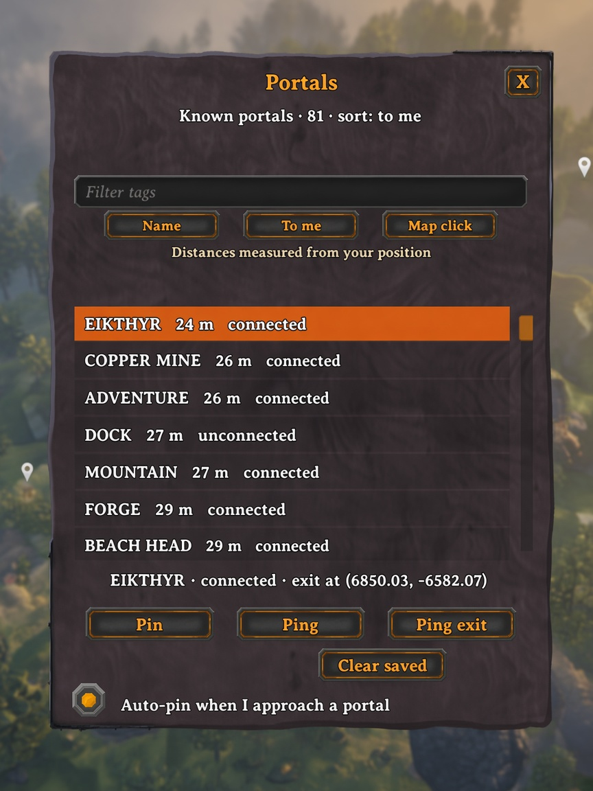

# Portal Atlas

Personal portal journal and map panel for Valheim. Record gates as you find them, sort and search them on the large map, and optionally **Refresh world** for a full server-wide list if you are an admin. Vanilla tag pairing is unchanged.

| | |
| --- | --- |
| Version | 1.2.6 |
| GUID | `sonicdm.valheimportallist` |
| Dependencies | BepInExPack Valheim, [Jötunn](https://thunderstore.io/c/valheim/p/ValheimModding/Jotunn/), [Server Devcommands](https://thunderstore.io/c/valheim/p/JereKuusela/Server_devcommands/) *(dedicated Refresh only)* |

## Requirements

| What you want | Game client | Dedicated server |
| --- | --- | --- |
| Journal + panel only | Portal Atlas + **Jötunn** | Not required |
| **Refresh world** on a dedicated server | Portal Atlas + Jötunn + **Server Devcommands**, and your id in the server `adminlist.txt` | Portal Atlas + **Jötunn** + **Server Devcommands** |
| Offline / listen host (you host the world) | Portal Atlas + Jötunn | — (you are the host; Refresh works locally) |

Notes:

- Gale / r2modman install Jötunn and Server Devcommands from `manifest.json` on the **client**.
- The **dedicated server** must also have Portal Atlas and Jötunn (same as other Jötunn mods). Put Server Devcommands on the server if you use admin Refresh.
- You do **not** need to turn on vanilla `devcommands` / cheats. Server Devcommands already confirms admin via `adminlist.txt`.

## How to use

1. Approach, use, or travel through a portal — it is saved to your **local journal** (per world + character).
2. Open the large map (`M`) → **Portals**, or run `portals`.
3. Filter by tag; sort by **Name**, **To me**, or **Map click**.
4. Select a row → **Pin**, **Ping**, or **Ping exit**.
5. If Refresh is available: **Refresh world** loads a live server list (session only). Use **Add to journal** on rows you want to keep. **Show known** returns to the journal.

Approach range (journal + optional auto-pin): config `Pins.ApproachRangeMeters` (default `8`).

**Clear saved** only removes pins this mod created. Manually placed map pins are never touched.

## Refresh world

Never runs automatically when the panel opens. **Never** writes your journal by itself.

On a dedicated server, after you join, the client **handshakes** with the host (`PortalAtlas_Hello` / `HelloAck`). Refresh is enabled only when:

1. The host has Portal Atlas (handshake succeeds), and  
2. Server Devcommands reports you as admin.

The panel shows a status line under the Refresh button, for example:

| Status | Meaning |
| --- | --- |
| `Refresh: ready (admin)` / `ready (server x.y.z, admin)` | Handshake OK and you are admin — button works |
| `Refresh: ready (you are host)` | Offline / listen host — local scan |
| `Refresh: checking server…` | Waiting for the host handshake |
| `Refresh: server incompatible (no Portal Atlas)` | Host did not answer — install Portal Atlas (+ Jötunn) on the dedicated server |
| `Refresh: Server Devcommands missing` | Install Server Devcommands on this client (and the server) |
| `Refresh: not an admin` | Handshake OK, but you are not on `adminlist.txt` / not authorized yet |
| `Refresh: scanning…` | Host is building the world list |

When Refresh is unavailable, the button stays visible but greyed out.

## Install

**Client:** install with Gale / r2modman / Thunderstore (`SonicDM-PortalAtlas`).

**Dedicated server:** install the same package (or drop `PortalAtlas.dll`) **and** Jötunn. Add Server Devcommands if admins should use Refresh. Restart the server after installing.

Both client and server should run the **same Portal Atlas version** when using Refresh.

## Commands

| Command | Purpose |
| --- | --- |
| `portals` | Toggle the Portals panel (opens the large map if needed) |
| `portallist` | Export every portal to CSV under `BepInEx/cache/PortalAtlas/` (host, or dedicated admin) |

## Files

Under `BepInEx/cache/PortalAtlas/` (not config):

- Journal JSON per world + character
- Host CSV / tag summary / text report (startup dump and `portallist`)

## Troubleshooting

| Problem | Check |
| --- | --- |
| No Portals button / panel | Jötunn installed on the client; look for `Portal Atlas … loaded` in `BepInEx/LogOutput.log` |
| `server incompatible` | Portal Atlas + Jötunn on the **dedicated** server; matching version; server log shows the mod loaded |
| `not an admin` | Steam / PlayFab id in `adminlist.txt`; Server Devcommands on **client and server**; wait until it says you are authorized |
| Refresh hangs / disconnect icon | Update to 1.2.5+ (time-sliced scan). Ensure server and client both have that build |

Set `General.DebugLogging = true` in the mod config for `[DEBUG]` lines (journal, handshake, Refresh RPC, access) in `BepInEx/LogOutput.log`.
